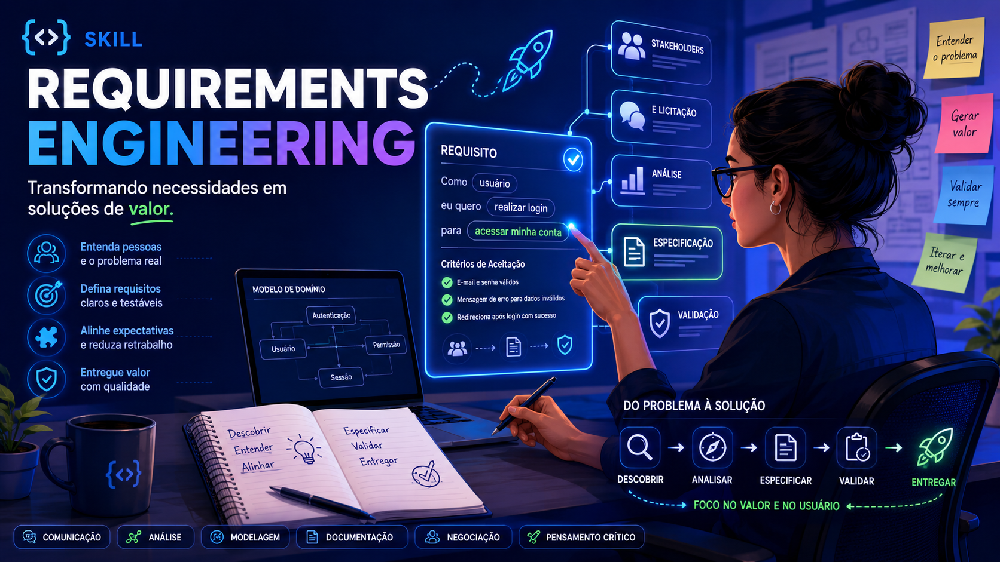

<p align="center">
  
</p>

# Requirements Engineering — Claude Code Skill

[](https://creativecommons.org/licenses/by-sa/4.0/)
[](./SKILL.md)
[-success)](#language-status)
[](#language-status)
[](https://github.com/seekdevcore/sk-requirements-engineering-theskill/releases/latest)
[](https://github.com/seekdevcore/sk-requirements-engineering-theskill/actions/workflows/quality.yml)
[](./CODE_OF_CONDUCT.md)

> **Skill for [Claude Code](https://claude.com/claude-code)** that loads canonical knowledge of **Requirements Engineering**, **Business Analysis**, and **Professional Ethics in Computing** into any Claude session — built from the full course material of *"IFPB"* (*"Instituto Federal da Paraíba"*) plus the canonical bibliography of the field (Sommerville, Pressman, Wiegers, Cohn, Robertson, Hull, Falbo, BABOK v3, *"SBC"* 002/2024).

> **Why some terms are kept in Brazilian Portuguese**: the primary corpus of this skill is a course taught in pt-BR, and many domain-specific entities (institutions, organizations, public-sector systems, project codenames, regulatory frameworks) lose meaning if translated. Throughout the content, such terms appear in *italic and quotes* — e.g. *"IFPB"*, *"Interpop"*, *"ABCD"*, *"COB"*, *"Bolsa Atleta"*, *"LGPD"*, *"SBC"*, *"CNPq"*. This is intentional and aligned with the CC BY-SA 4.0 attribution requirement.

---

## ⚡ Language status

| Language | Status | Current content |
|---|---|---|
| **en-CA** (default declared in frontmatter) | 🟢 Complete | All content translated as of v1.2.0: entry point ([`SKILL.md`](./SKILL.md), [`README.md`](./README.md), [`CHANGELOG.md`](./CHANGELOG.md)), [`references/`](./references/) (14 files), [`examples/`](./examples/) (8 files — incl. SaaS multi-tenant / fintech / government worked case studies + `feature-step-defs/` — 6-stack BDD bindings), [`assets/`](./assets/) (scaffolder + generic template tree). Brazilian acronyms (`RF`, `RNF`, `G`, `CA`, `US`, `EP-NN`, `F-NN`, `USNN.M`, `TNN.M.K`, `TX-NN`, `G-NN`) and domain terms in *italic + quotes* preserved by design. |
| **pt-BR** | 🟢 Complete | **Full pt-BR translation at [`translations/pt-BR/`](./translations/pt-BR/)** — a faithful mirror of the en-CA source kept current through v1.14.0 (`SKILL.md` incl. §0 first-run / §3.1 SDD / EARS, `references/` 01–13, `examples/` (8, incl. SaaS/fintech/government case studies) + `feature-step-defs/`). The original *"IFPB"* course language; authoritative for compliance/audit reference. |

> **If you read English**: every file root-level is in en-CA. The skill is fully usable end-to-end; references and examples are translated. Some pt-BR content remains by design: domain terms in *italic+quotes*, real-project artifact identifiers (Feature/AC/US titles from *"Interpop"* / *"Controle de Dopagem"*), Gherkin scenarios from the *"IFPB"* course material, and the `template-user-story.feature` template (with documented en-CA dialect option in its header).
>
> **Se você lê português**: o conteúdo completo em pt-BR vive em [`translations/pt-BR/`](./translations/pt-BR/) — espelho fiel da fonte en-CA, mantido até a v1.14.0 (SKILL.md com §0/§3.1/EARS, referências 01–13, exemplos (8, incl. casos SaaS/fintech/governo) + feature-step-defs/). Continua íntegro e atualizado.

---

## 📦 Installation

> **3 install paths**, depending on where you want to consume the methodology:
>
> | Path | Best for | One-liner |
> |---|---|---|
> | **Native skill** (this section) | Claude Code CLI users | `git clone … ~/.claude/skills/engenharia-de-requisitos` |
> | **Plugin marketplace** ([§Plugin install](#-claude-code-plugin-install-1-liner)) | Claude Code users who want managed install + auto-update | `/plugin marketplace add seekdevcore/sk-requirements-engineering-theskill` |
> | **MCP server** ([§MCP server](#-mcp-server-for-claude-desktop--cursor--cline--continue--zed--any-mcp-client)) | Claude Desktop · Cursor · Cline · Continue · Zed · OpenAI Responses · custom agents | `uv run requirements-engineering-mcp` |

### Option 1 — Clone directly into your global skills folder (recommended)

```bash
# 1. Clone the repo into Claude Code's global skills directory
cd ~/.claude/skills/
git clone git@github.com:seekdevcore/sk-requirements-engineering-theskill.git engenharia-de-requisitos

# 2. Verify the skill loads
ls ~/.claude/skills/engenharia-de-requisitos/SKILL.md

# 3. Open a new Claude Code session and invoke
# (the skill auto-discovers on session start)
```

### Option 2 — Clone elsewhere and symlink

```bash
# 1. Clone wherever you keep your repos
git clone git@github.com:seekdevcore/sk-requirements-engineering-theskill.git ~/repos/sk-requirements-engineering

# 2. Create a symlink into Claude's skills folder
ln -s ~/repos/sk-requirements-engineering ~/.claude/skills/engenharia-de-requisitos

# 3. Verify
readlink ~/.claude/skills/engenharia-de-requisitos
```

### Option 3 — HTTPS clone (if you don't have SSH keys configured)

```bash
git clone https://github.com/seekdevcore/sk-requirements-engineering-theskill.git ~/.claude/skills/engenharia-de-requisitos
```

### Verifying installation

In a new Claude Code session, type:

```
List the skills I have installed.
```

You should see `engenharia-de-requisitos` in the list. Then invoke it explicitly:

```
> Skill: engenharia-de-requisitos
```

---

## 🧩 Claude Code plugin install (1-liner)

> Same skill as above, packaged as a Claude Code **plugin marketplace** — managed install + auto-update + uninstall, no manual `git clone` required.

In a Claude Code session:

```text
/plugin marketplace add seekdevcore/sk-requirements-engineering-theskill
/plugin install engenharia-de-requisitos
```

The skill is now available globally. Updates flow via `/plugin update`. Uninstall via `/plugin uninstall engenharia-de-requisitos`.

This route uses [`.claude-plugin/marketplace.json`](./.claude-plugin/marketplace.json) and [`.claude-plugin/plugin.json`](./.claude-plugin/plugin.json) declared at the root of this repo.

---

## 🌐 MCP server (for Claude Desktop · Cursor · Cline · Continue · Zed · any MCP client)

> **For everyone NOT on Claude Code CLI.** The methodology corpus is also exposed as an MCP server (`mcp-server/`) so it is reachable from any client that speaks the Model Context Protocol — Claude Desktop, Cursor, Cline, Continue, Zed, OpenAI Responses API with the `openai-mcp` bridge, custom LangChain/LlamaIndex agents, etc.

**Resources exposed**: `requirements://skill`, `requirements://reference/{name}`, `requirements://example/{name}`, `requirements://catalog`.

**Tools exposed**: `list_references()`, `list_examples()`, `list_hard_rules()`, `validate_user_story(title, bdd?)`, `validate_acceptance_criterion(text)`.

Quick start:

```bash
git clone https://github.com/seekdevcore/sk-requirements-engineering-theskill.git
cd sk-requirements-engineering/mcp-server
uv sync
uv run requirements-engineering-mcp        # boots on stdio
```

Full setup with copy-pasteable config blocks for Claude Desktop, Cursor, Cline, Continue, Zed, and Claude Code CLI in [**`mcp-server/README.md`**](./mcp-server/README.md).

---

## 🎯 When to invoke this skill

Invoke when you (or Claude on your behalf) are doing:

- **First contact with a project (mandatory first action)** — the moment the skill is applied to a folder, it auto-analyzes the project and **detects/builds the on-disk structure** (`docs/requirements/` + `docs/backlog/` + ADRs) before any other work, including **migrating projects from older skill versions** that left a loose `REQUISITOS*.md` with no traceability spine (see [`SKILL.md §0`](./SKILL.md))
- **Requirements discovery** — interviews, surveys, brainstorming, ethnography, document analysis, stories and scenarios
- **Specification** — building a hierarchical backlog (Epic → Feature [+ description + ACs] → User Story [+ BDD] → Task)
- **User Stories with BDD** — writing `Given / When / Then` that bridges requirement and executable test
- **Acceptance Criteria** — declarative testable rules per feature (with the `[...]` convention for sub-rules)
- **Estimation** — Story Points + Planning Poker (Fibonacci scale)
- **Validation** — Sommerville's 5 checks + Falbo's 7 dimensions + lo-fi/hi-fi prototypes
- **Change management + traceability** — keeping docs ↔ code ↔ test aligned
- **Business analysis** — BABOK v3, BPMN, AS-IS / TO-BE, MoSCoW, RICE
- **Professional ethics** — *"SBC"* 002/2024 Code applied to privacy, ML/AI, inclusion, system decommissioning

**Do not invoke for pure code implementation.** Requirements Engineering covers the stage **before** (discovering what to build) and **after** (validating that what was built is correct) — not the middle.

---

## 🗂 Repository structure

```
engenharia-de-requisitos/
├── SKILL.md                       ← entry point + usage protocol (map) — en-CA
├── README.md                      ← this file — en-CA
├── LICENSE                        ← CC BY-SA 4.0
├── CHANGELOG.md                   ← version history — en-CA
├── CONTRIBUTING.md                ← how to contribute (7-section operational guide)
├── CODE_OF_CONDUCT.md             ← Contributor Covenant 2.1 + SBC 002/2024 cross-refs
├── .claude-plugin/                ← Claude Code plugin marketplace manifest
│   ├── marketplace.json
│   └── plugin.json
├── mcp-server/                    ← MCP server for Claude Desktop / Cursor / Cline / etc.
│   ├── src/requirements_engineering_mcp/
│   │   ├── __init__.py
│   │   └── server.py              ← FastMCP — Resources + Tools wrapping the corpus
│   ├── pyproject.toml             ← uv project (mcp[cli]>=1.2.0)
│   ├── .python-version            ← 3.12
│   └── README.md                  ← full client-config docs (Claude Desktop, Cursor, etc.)
├── .github/
│   ├── workflows/
│   │   ├── quality.yml            ← CI: markdown-lint + link-check + yaml-schema + actionlint
│   │   └── sync-upstream.yml      ← fork-only: auto-sync with upstream every 30 min
│   ├── PULL_REQUEST_TEMPLATE.md
│   └── ISSUE_TEMPLATE/            ← bug-or-fix, content-proposal, question-or-clarification
├── .markdownlint.json             ← tuned config (8 rules disabled/relaxed, all documented inline)
├── .lycheeignore                  ← 12 URL patterns intentionally skipped (rate-limited / bot-blocked)
├── .yamllint.yml                  ← YAML lint config for .github/ schema
├── assets/                        ← hero banner + visual assets (pt-BR diagram)
│   └── banner.png
├── translations/
│   └── pt-BR/                     ← full pt-BR copy of all content
│       ├── SKILL.md
│       ├── README.md
│       ├── CHANGELOG.md
│       ├── references/            (same files as below, in pt-BR)
│       └── examples/              (same files as below, in pt-BR)
├── references/                    ← canonical detail (loaded on demand)
│   ├── 01-fundamentos.md          (FR vs NFR, stakeholders, feasibility, spiral, MVP+A/B)
│   ├── 02-elicitacao.md           (6 techniques, 5W, scales, brainstorming)
│   ├── 03-especificacao.md        (Backlog, Epic→Feature→US→AC, INVEST, multiple root Epics)
│   ├── 04-bdd-criterios-aceitacao.md  (BDD, Three Amigos, AC vs Gherkin, [...] convention)
│   ├── 05-estimativa.md           (Story Points, Planning Poker, velocity)
│   ├── 05-convencoes-interpop.md  (10 hard rules: source-of-truth document, naming, [...], etc.)
│   ├── 06-validacao.md            (5 checks + 7 dimensions + prototypes)
│   ├── 07-mudanca-rastreabilidade.md  (change management, RTM, enduring vs volatile requirements)
│   ├── 08-analista-negocios.md    (BABOK, AS-IS/TO-BE, MoSCoW, RICE, Kano)
│   ├── 09-etica-sbc.md            (SBC 002/2024 Code applied to RE)
│   ├── 10-estrutura-projeto.md    (on-disk structure: requirements/+backlog/+specs/+two-tier ADRs; detect→create→reorganize; LEGACY-MONOLITH migration)
│   ├── 11-ears.md                 (EARS — optional precision layer; 5 patterns EN/pt-BR; RF→EARS→CA→Gherkin)
│   └── 12-sdd-interop.md          (optional SDD bridge — OpenSpec/Spec Kit crosswalk; check_projection_drift)
├── assets/
│   ├── scaffold-structure.sh      (detect → create → reorganize scaffolder; GREENFIELD/HAS-STRUCTURE/LOOSE-FILES/LEGACY-MONOLITH)
│   ├── project-to-sdd.sh          (project docs/ → OpenSpec/Spec Kit, preserving [RF-NN]; pairs with check_projection_drift)
│   └── templates/                 (generic, adaptive template tree the scaffolder materializes)
└── examples/
    ├── caso-controle-dopagem.md         (real CNPq case — *"ABCD"*/*"COB"*)
    ├── caso-interpop-moderacao.md       (Interpop project case — ban hierarchy)
    ├── template-backlog-openproject.md  (full worked backlog template)
    ├── template-documento-requisitos.md (IEEE 830 / Wiegers / Sommerville template)
    └── template-user-story.feature      (Gherkin pt-BR ready-to-copy)
```

> **Note on `references/` and `examples/` filenames**: the filenames are kept in pt-BR for backward compatibility with projects that already reference them (e.g., *"Interpop"*). Their **internal content was translated to en-CA in v1.2.0**. The verbatim pt-BR snapshot remains reachable at `translations/pt-BR/`.

**Usage pattern**: `SKILL.md` is a map (§0 mandatory first-run structure check, then §1–§10) with links to detail. You read `SKILL.md` to locate the answer; you read a `reference` only when you need full detail on that topic.

---

## 👩‍🏫 About the source instructor

The course material that constitutes the primary corpus of this skill — *"IFPB"* ERS (*"Engenharia de Requisitos de Software"* / Software Requirements Engineering) — was created and taught by **Prof. Dr. *"Juliana Dantas Ribeiro Viana de Medeiros"*** ([Lattes CV](http://lattes.cnpq.br/9730254173461923) · [ORCID 0000-0001-8387-4616](https://orcid.org/0000-0001-8387-4616)).

Her credentials make this skill content **academically and industrially grounded**, not a generic summary:

### Academic credentials

- **Ph.D. in Computer Science / Software Engineering** — *"Universidade Federal de Pernambuco"* (UFPE), 2017
- **Doctoral thesis**: *"An approach to support the Requirements Specification in Agile Software Development"* — **the exact subject of this skill**
- **Doctoral sandwich period**: *"Universidade Nova de Lisboa"* (UNL, Portugal), 2016 — advised by Miguel Goulão (Portugal) and Carla Schuenemann
- Funded by the **BRAZILEUROPE MUNDUS (BEMUNDUS)** Erasmus Mundus scholarship programme
- **M.Sc. in Computer Science** — UFPE, 2001 (thesis on ISO 9001:2000 in software companies; *"CNPq"* scholarship)
- **B.Sc. in Computer Science** — *"Universidade Federal da Paraíba"* (UFPB), 1997

### Active research lines (relevant to this skill)

1. **Requirements Engineering in Agile Projects** (since 2014) — direct base of this skill
2. Agile software development
3. *"Sistema de Informação para Controle de Dopagem"* (*"CNPq"* DTI-A, 2014-2015 — **origin of the *"Controle de Dopagem"* worked example** in `examples/caso-controle-dopagem.md`)
4. BPM (Business Process Management) automation

### Industrial experience (20+ years)

- ***"DATAPREV"*** (Federal Data Processing Service for Social Security) — IT Analyst, project manager of *"Ministério do Trabalho"*'s *"Plano Nacional de Qualificação"* (2006–2013, public competition entry)
- ***"CESAR"*** (*"Centro de Estudos e Sistemas Avançados do Recife"*) — Project Manager (2005–2006)
- ***"CAGEPA"*** (*"Paraíba"* state water utility) — Systems Analyst (2005–2006, public competition entry)
- ***"Ministério Público da Paraíba"*** — Software Development Consultant (2002–2003)
- ***"Prefeitura Municipal de João Pessoa/PB"*** — Project Manager / Lead Analyst (1997–2005, including *"IPTU"*/*"ITBI"*/*"Taxa de Lixo"* tax systems, *"Sistema de Cadastro Mercantil"*, *"Sistema Plano Plurianual e Orçamentário"*)
- Past collaborations with ***"Multilaser"***, ***"CPM Braxis"***

### Faculty position

- ***"Professor Efetivo"* (tenured), *"Dedicação Exclusiva"*** at ***"IFPB Campus João Pessoa"*** since 2006 — entered through public competition, **first place**
- Active researcher at the ***"EMBRAPII"*** (*"Empresa Brasileira de Pesquisa e Inovação Industrial"*) hub at *"IFPB"*
- ***"CNPq"* DTI-A** researcher (*"Desenvolvimento Tecnológico e Industrial"*, Category A)
- Faculty member at ***"Universidade Federal de Campina Grande"*** (UFCG) since 2020
- Has supervised 50+ undergraduate students, 3 specialization students, 5+ undergraduate research students (*"IC"*), and is currently co-supervising 1 Ph.D. candidate and 10 *"ICs"*

### Pedagogical resources beyond the *"IFPB"* course

- **PMBOK** certification (Qualiti, 2005)
- Coordinator of multiple ongoing research repositories: *"Boas Práticas em Processos de Desenvolvimento de Software"*, *"Práticas em Gerenciamento de Projetos de Software"*, *"Ambiente de Boas Práticas Reconfiguráveis em Engenharia de Software"*

**This skill exists because Prof. Juliana made her course material publicly available for educational use.** Any improvements, translations, or derivations should preserve attribution to her authorship of the original corpus (per the CC BY-SA 4.0 license).

> **Citing the source material in academic work**: Medeiros, J. D. R. V. de. *Engenharia de Requisitos de Software* [course material, lectures 0–10]. *"Instituto Federal de Educação, Ciência e Tecnologia da Paraíba"* (*"IFPB"*), Campus *"João Pessoa"*, 2025. Available at her *"IFPB Campus João Pessoa"* Google Classroom; see also her Lattes CV at http://lattes.cnpq.br/9730254173461923.

---

## 📚 Sources (corpus that fed the skill)

Built from the complete course material of **ERS — Requirements Engineering** at ***"IFPB Campus João Pessoa"*** (Prof. Dr. *"Juliana Dantas Ribeiro Viana de Medeiros"* — see [About the source instructor](#-about-the-source-instructor) above), complemented by the canonical bibliography:

- **Sommerville, I.** *Software Engineering*, 10th ed. Pearson 2019 (Ch. 4 read integrally)
- **Pressman, R.** *Software Engineering: A Practitioner's Approach*, 9th ed. McGraw-Hill 2021
- **Wiegers, K. & Beatty, J.** *Software Requirements*, 3rd ed. Microsoft Press
- **Cohn, M.** *User Stories Applied*, 2004
- **Robertson, S. & Robertson, J.** *Mastering the Requirements Process* (VOLERE method)
- **Hull, E., Jackson, K., Dick, J.** *Requirements Engineering*, 4th ed. Springer
- **Falbo, R. A.** Lecture notes — UFES
- **IIBA.** *BABOK Guide* v3
- ***"SBC"*.** Resolution 002/2024 — Code of Ethics and Professional Conduct
- **Valente, M. T.** *Engenharia de Software Moderna* (engsoftmoderna.info, MVP + A/B testing)

*"IFPB"* lectures processed (in order):

- LECTURE 0 — Course presentation
- LECTURE 01 — Introduction to RE (real cases: $500M *"Citibank"*, Boeing 737 MAX, *"INSS"*, *"IPTU SP"*)
- LECTURE 02 — RE process + FR vs NFR
- LECTURE 03 — Real *"CNPq"* *"Controle de Dopagem"* case (full execution)
- LECTURE 04 — Elicitation via Interviews
- LECTURE 05 — Elicitation via Questionnaire + Brainstorming
- LECTURE 06 — Elicitation via Ethnography + Document Analysis
- LECTURE 07 — Specification: Initial backlog (OpenProject)
- LECTURE 08 — Specification: Acceptance Criteria
- LECTURE 09 — Specification: User Stories (BDD integrated)
- LECTURE 09.2 — Sizing estimation with User Story Points (Planning Poker)
- LECTURE 10 — Validation through interface prototypes

---

## 📖 Vocabulary (pt-BR ↔ en-CA glossary)

This skill uses idiomatic English terminology for general technical concepts, but **preserves Brazilian acronyms** (RF, RNF, G, CA, US, EP, F, T, TX) for visual identity and backward compatibility with existing projects (*"Interpop"*, *"SIRA"*, *"Controle de Dopagem"*).

| pt-BR (term) | en-CA (term) | Acronym (preserved) |
|---|---|---|
| Engenharia de Requisitos | Requirements Engineering | RE |
| Requisito Funcional | Functional Requirement (FR) | `RF` |
| Requisito Não Funcional | Non-Functional Requirement (NFR) | `RNF` |
| Critério de Aceitação | Acceptance Criterion (AC) | `CA` |
| História de Usuário | User Story | `US` |
| Regra de Negócio | Business Rule (BR) | `G` |
| Épico / Epic | Epic | `EP` |
| Funcionalidade | Feature | `F` |
| Tarefa | Task | `T` |
| Tarefa Transversal | Cross-cutting Task | `TX` |
| Backlog do produto / da sprint | Product Backlog / Sprint Backlog | — |
| DADO / QUANDO / ENTÃO | Given / When / Then | — |
| Funcionalidade: (Gherkin) | Feature: (Gherkin) | — |
| Cenário: (Gherkin) | Scenario: (Gherkin) | — |

> **Why the acronyms are preserved**: real projects already use `EP-NN`, `F-NN`, `CA-NN`, `USNN.M`, `TNN.M.K`, `TX-NN`, `G-NN` in OpenProject, in commit messages, in code comments, and in pull-request titles. Renumbering them to `EP/FT/AC/US/TK/XT/BR` would break years of traceability for no real gain. The English terms are used in prose; the acronyms remain pt-BR-rooted.

Cucumber, Behave, SpecFlow, and Behat support localized Gherkin natively. To author `.feature` files in pt-BR, add `# language: pt` at the top; for en-CA the default is sufficient.

---

## 🤝 Contributing

Pull requests welcome — especially for:

1. Additional real-world worked examples (case studies from other domains: fintech, govtech, healthtech, SaaS multi-tenant)
2. New `.feature` template variants per stack (pytest-bdd, behave, cucumber-js, cucumber-playwright, SpecFlow, Behat)
3. Tooling integration scaffolds (Linear, Jira, Notion, GitHub Issues, Plane)
4. Additional language translations (es, fr, de, it, etc.) under `translations/<bcp-47-tag>/`

When contributing, follow the same conventions documented in `references/05-convencoes-interpop.md` (10 hard rules: source-of-truth document, naming without infinitives, no technical terms in non-Task artifacts, grouped ACs with `[...]` convention, etc.).

For en-CA translation contributions, preserve:

- **All pt-BR domain terms** in *italic + quotes* (institutions, organizations, government systems, project codenames, regulatory frameworks)
- **All pt-BR acronyms** (`RF`, `RNF`, `G`, `CA`, `US`, `EP`, `F`, `T`, `TX`) — do not renumber to English
- **Cross-references** between files (when a reference points to `references/05-convencoes-interpop.md`, the link stays valid because the filename is preserved)

---

## 📄 License

This skill content is licensed under **[Creative Commons Attribution-ShareAlike 4.0 International (CC BY-SA 4.0)](https://creativecommons.org/licenses/by-sa/4.0/)**.

You are free to:

- **Share** — copy and redistribute in any medium or format
- **Adapt** — remix, transform, and build upon the material for any purpose, even commercially

Under the following terms:

- **Attribution** — give appropriate credit to **Prof. Dr. *"Juliana Dantas Ribeiro Viana de Medeiros"*** as author of the original course material (see [About the source instructor](#-about-the-source-instructor) for the academic citation format), and indicate if changes were made
- **ShareAlike** — distribute your contributions under the same license

See [`LICENSE`](./LICENSE) for the full legal code.

---

## 🏷 Maintainer

Published by [**Seek**](https://github.com/seekdevcore) (`seekdevcore` on GitHub).

Original author and curator: **Gabriel Marques** ([@GabeMarques-Intetsu](https://github.com/GabeMarques-Intetsu)).
